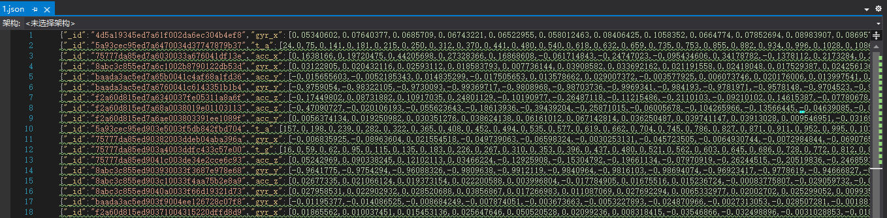
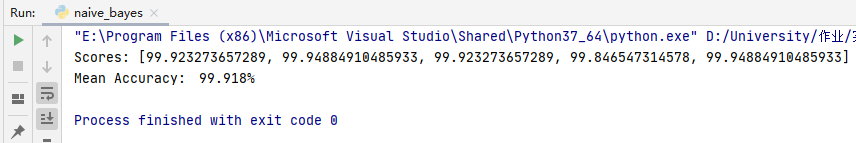
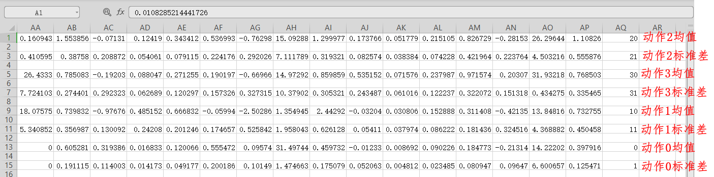
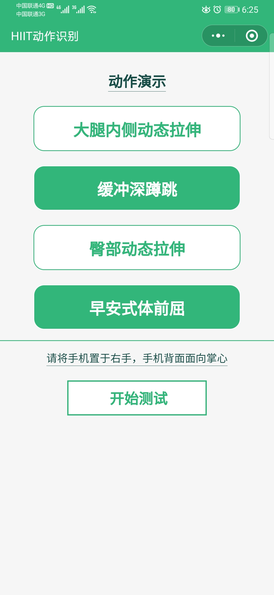
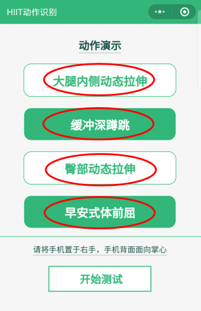
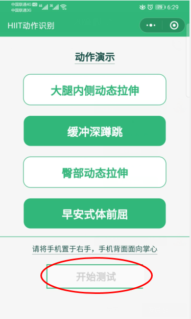
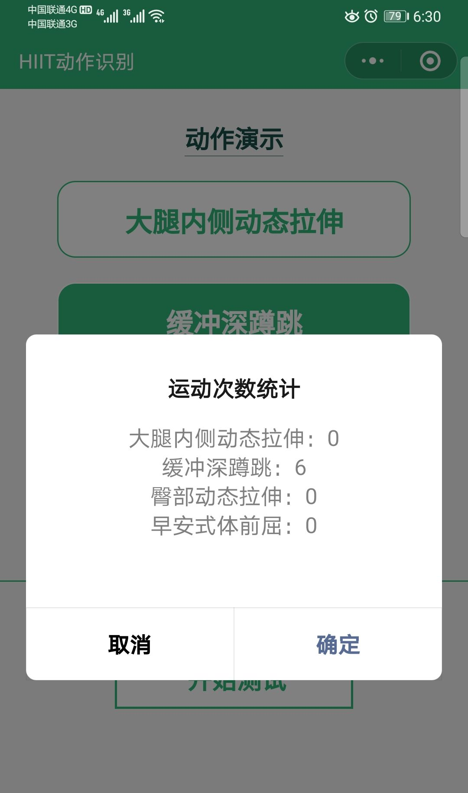

# Readme

小程序实现过程分为三大步：1.数据采集及处理	2.模型训练	3.模型部署

## 1.数据采集及处理

- ### 采集

  - 六轴加速度传感器
  - 采样频率：20HZ
  - 每次采集10s
  - 保存为JSON格式
  - 

- ### 处理

  - ##### 提取特征

    - 每轴提取7个时域特征：最小值，最大值，最大值与最小值之差，均值，方差，标准差，正值个数
    - 每个窗口共提取出6×7=42个特征

  - ##### 不施加滤波

  - ##### 导出为csv文件


## 2.模型训练

利用朴素贝叶斯算法，仅提取时域特征，正确率大约为99.9%

- #### 模型训练源代码

  - ```python
    from csv import reader
    from csv import writer
    from random import seed
    from random import randrange
    from math import sqrt
    from math import exp
    from math import pi
    
    
    # load csvfile
    def load_csv(filename):
        dataset = []
        with open(filename, 'r') as file:
            csv_reader = reader(file)
            for row in csv_reader:
                if not row:
                    continue
                dataset.append(row)
        return dataset
    
    
    # convert string column to float
    def str_col_to_float(dataset, column):
        for row in dataset:
            row[column] = float(row[column].strip())
    
    
    # convert string column to integer
    def str_col_to_int(dataset, column):
        for row in dataset:
            row[column] = int(row[column].strip())
    
    
    # split a dataset into k folds
    def cross_validation_split(dataset, n_folds):
        dataset_split = []
        dataset_copy = list(dataset)
        fold_size = int(len(dataset) / n_folds)
    
        for _ in range(n_folds):
            fold = []
            while len(fold) < fold_size:
                index = randrange(len(dataset_copy))
                fold.append(dataset_copy.pop(index))
            dataset_split.append(fold)
        return dataset_split
    
    
    # calculate accuracy percentage
    def accuracy_metric(actual, predicted):
        correct = 0
        for i in range(len(actual)):
            if actual[i] == predicted[i]:
                correct += 1
        return correct / float(len(actual)) * 100.0
    
    
    # evaluate an algorithm using a cross validation split
    def evaluate_algorithm(dataset, algorithm, n_folds, *args):
        folds = cross_validation_split(dataset, n_folds)
        scores = []
        for fold in folds:
            train_set = list(folds)  # 复制folds
            train_set.remove(fold)
            train_set = sum(train_set, [])  # ☆单列表生成
            test_set = []
            for row in fold:
                row_copy = list(row)
                test_set.append(row_copy)
                row_copy[-1] = None
            predicted = algorithm(train_set, test_set, *args)
            actual = [row[-1] for row in fold]
            accuracy = accuracy_metric(actual, predicted)
            scores.append(accuracy)
        return scores
    
    
    # split the dataset by class values, returns a dictionary
    def separate_by_class(dataset):
        separated = dict()
        for i in range(len(dataset)):
            vector = dataset[i]
            class_value = vector[-1]
            if class_value not in separated:
                separated[class_value] = []
            separated[class_value].append(vector)
        return separated
    
    
    # calculate the mean of a list of numbers
    def mean(numbers):
        return sum(numbers) / float(len(numbers))
    
    
    # calculate the standard deviation of a list of numbers
    def stdev(numbers):
        avg = mean(numbers)
        variance = sum([(x - avg) ** 2 for x in numbers]) / float(len(numbers) - 1)
        return sqrt(variance)
    
    
    # calculate the mean, stdev and count for each column in a dataset
    def summarize_dataset(dataset):
        summaries = [(mean(column), stdev(column), len(column)) for column in zip(*dataset)]  # zip(*)转置相关☆
        del (summaries[-1])
        return summaries
    
    
    # split dataset by class then calculate statistics for each row
    def summarize_by_class(dataset):
        separated = separate_by_class(dataset)
        summaries = dict()
        for class_value, rows in separated.items():
            summaries[class_value] = summarize_dataset(rows)
        return summaries
    
    
    # calculate the Gaussian probability distribution function for x
    def calculate_probability(x, mean, stdev):
        if stdev != 0:
            exponent = exp(-((x - mean) ** 2 / (2 * stdev ** 2)))
            return (1 / (sqrt(2 * pi) * stdev)) * exponent
        elif x == mean:
            return 1
        else:
            return 0
    
    
    # calculate the probabilities of predicting each class for a given row
    def calculate_class_probabilities(summaries, row):
        total_rows = sum([summaries[label][0][2] for label in summaries])  # label 遍历 key
        # for label in summaries:
        #     print(label,'  ',summaries[label][0][2])
        probabilities = dict()
        for class_value, class_summaries in summaries.items():
            probabilities[class_value] = summaries[class_value][0][2] / float(total_rows)
            for i in range(len(class_summaries)):
                mean, stdev, _= class_summaries[i]
                probabilities[class_value] *= calculate_probability(row[i], mean, stdev)  # 逐列
        return probabilities
    
    
    # predict the class for a given row
    def predict(summaries, row):
        probabilities = calculate_class_probabilities(summaries, row)
        best_label, best_prob = None, -1
        for class_value, probability in probabilities.items():
            if best_label is None or probability > best_prob:
                best_prob = probability
                best_label = class_value
        return best_label
    
    
    def save_summaries(summar):
        with open('naiveRes.csv','w') as naive:
            w = writer(naive)
            for k,v in summar.items():
                summar[k] = list(map(list,zip(*summar[k])))
                summar[k].pop()
                summar[k][0].append(k*10)
                summar[k][1].append(k*10+1)
                w.writerow(summar[k][0])
                w.writerow(summar[k][1])
    
    
    # Naive Bayes Algorithm
    def naive_bayes(train, test):
        summarize = summarize_by_class(train)
        predictions = list()
        for row in test:
            output = predict(summarize, row)
            predictions.append(output)
        save_summaries(summarize)
        return predictions
    
    
    seed(30)
    filename = './features.csv'
    dataset = load_csv(filename)
    for i in range(len(dataset[0]) - 1):
        str_col_to_float(dataset, i)
    str_col_to_int(dataset, len(dataset[0]) - 1)
    n_folds = 5
    scores = evaluate_algorithm(dataset, naive_bayes, n_folds)  # 以函数对象作为参数
    print('Scores: %s' % scores)
    print('Mean Accuracy:　%.3f%%' % (sum(scores) / float(len(scores))))
    ```

- #### 测试效果

  

- #### 导出模型

  - ##### 42×8 矩阵：各特征值在四个动作下的均值与标准差
  - 

## 3.模型部署

JavaScript重写模型，离线识别

#### 将本地训练导出的模型重写为如下形式，即均值和方差按照动作分别存放

```json
mean: [   [动作0各特征的均值],[动作1各特征的均值],[动作2各特征的均值],[动作3各特征的均值]	],
stdev:[   [动作0各特征的标准差],[动作1各特征的标准差],[动作2各特征的标准差],[动作3各特征的标准差]	],
```


#### 模型核心代码

```javascript
  /*根据特征值计算四个动作的概率*/
  naive_calc_prob:function(fea){
    var mean = this.data.mean;
    var stdev = this.data.stdev;
    var rows = this.data.rows;
    var sum_row = 0;
    var prob = new Array(4);
    for(let i=0;i<4;i++){
      sum_row += rows[i];
    }
    for(let i=0;i<4;i++){
      prob[i] = rows[i]/sum_row;
      for(let j=0;j<fea.length;j++){
        if(stdev[i][j]!=0){
          prob[i] *= Math.exp(-((fea[j] - mean[i][j])*(fea[j] - mean[i][j]) / (
            2 * stdev[i][j] * stdev[i][j])));
          prob[i] *= (1/(Math.sqrt(2*Math.PI) * stdev[i][j]));
        }
        else if(fea[j]==mean[i][j])
            prob[i] *=1;
        else
            prob[i] *=0;
      }
    }
    return prob;
  },
```

### 微信小程序相关信息

- ##### 首页

  - 

- ##### 点击“动作演示”栏中的任意按钮可查看动作演示

  - 
  - 

- ##### 点击“开始测试”按钮开始测试

  - 点击按钮后，按钮变为disabled状态，以防止在测试过程中的误触
  - 
  - 30s计时过程中以3s为间隔播报当前动作

- ##### 计时结束后展示动作次数统计

  - 
  
- ##### 小程序已上线，可通过“人体动作识别”搜索

  - 

